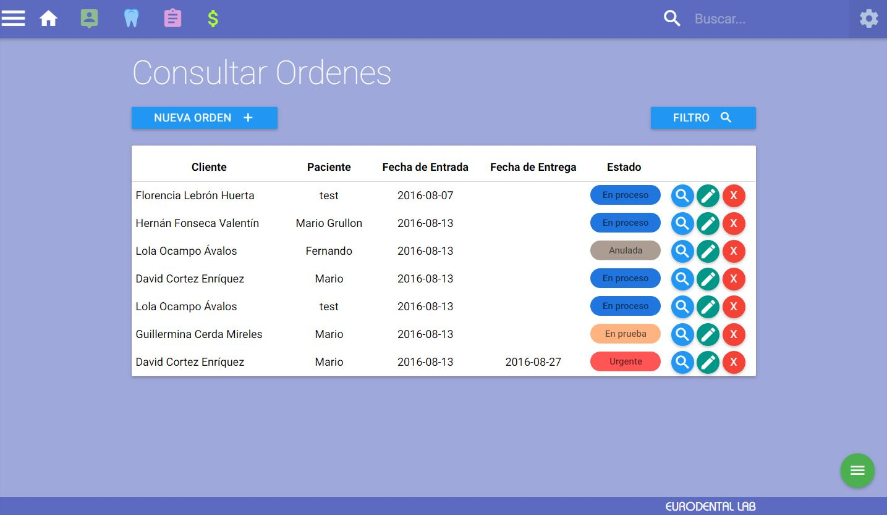
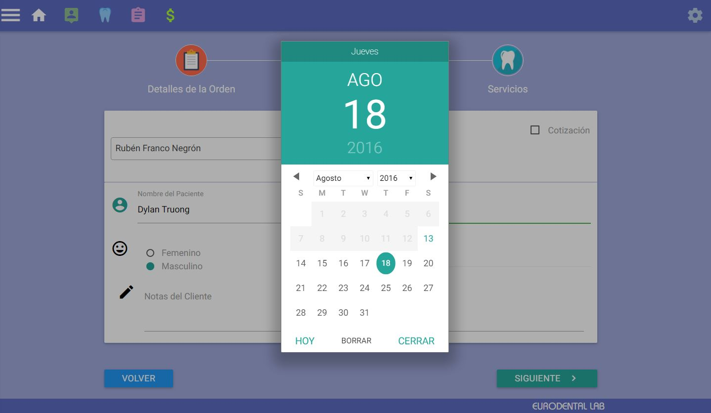
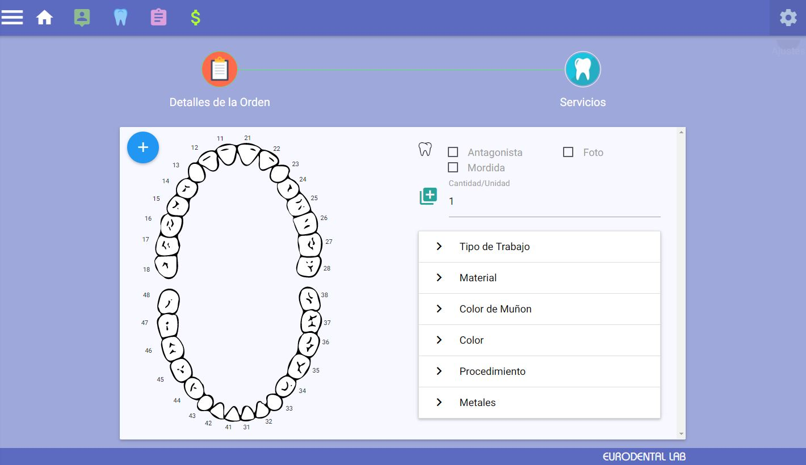

# Dental Lab App

###Summary

- Rails application for a Dental Laboratory to manage Clients/Patients orders.

#### Details
Rails Version => 4.2+
Ruby Version => 2.2.4
Templating System => Haml/haml-rails
UI Design => Materialize (http://materializecss.com/)
App Language => Spanish

Owner:
Mario Grullon

#### Installation
```
git clone https://github.com/mgitgrullon/Eurodental.git
bundle install
rake db:migrate
rake db:seed
rails s
```

---
###Screenshots



---
